# 1. Organization

## Definition

The **Organization** module defines the company's internal structure. It establishes the Company, Branches, Departments, Designations, and Employment Types that other ERP records depend on.

## Business purpose

Use this module to answer:

- Which legal/company entity owns the operation?
- Which branches exist?
- Which departments exist?
- Which designations are used?
- What types of employment does the company support?

## Mermaid

```mermaid
flowchart TD
    %% =========================================================
    %% ORGANIZATION
    %% Foundation of the company's internal structure.
    %% =========================================================

    A[Organization] --> B[Company]

    %% A company can have multiple operating branches.
    B --> C[Branches]

    %% Departments define functional business areas.
    B --> D[Departments]

    %% Designations define job positions within the organization.
    B --> E[Designations]

    %% Employment types define how employees are engaged.
    B --> F[Employment Types]

    %% Example branches
    C --> C1[Mumbai Head Office]
    C --> C2[Saudi Operations]
    C --> C3[UAE Office]

    %% Example departments
    D --> D1[Management]
    D --> D2[HR]
    D --> D3[Recruitment]
    D --> D4[Operations]
    D --> D5[Finance]
    D --> D6[Documentation]

    %% Example designations
    E --> E1[HR Manager]
    E --> E2[Recruiter]
    E --> E3[Operations Manager]
    E --> E4[Document Controller]
    E --> E5[Finance Manager]

    %% Example employment types
    F --> F1[Full Time]
    F --> F2[Contract]
    F --> F3[Temporary]
    F --> F4[Overseas Contract]
```

---

# 2. Users & Roles

## Definition

The **Users & Roles** module controls who can access ERPNext and what each user is allowed to view, create, edit, submit, approve, cancel, or report on.

## Business purpose

Permissions should follow actual responsibilities instead of giving everyone Administrator/System Manager access.

## Mermaid
```
flowchart TB
    %% =========================================================
    %% USERS & ROLES
    %% Role-centric access architecture
    %% =========================================================

    A["USER ACCESS"] --> B["BUSINESS ROLES"]

    %% ---------------------------------------------------------
    %% RECRUITMENT
    %% ---------------------------------------------------------
    B --> R["RECRUITMENT"]

    R --> R1["JDR"]
    R --> R2["Candidates"]
    R --> R3["Interviews"]
    R --> R4["Job Offers"]

    R1 --> R5["Create / Edit / Submit"]
    R2 --> R6["Create / Edit"]
    R3 --> R7["Manage"]
    R4 --> R8["Create / Submit"]

    %% ---------------------------------------------------------
    %% HR
    %% ---------------------------------------------------------
    B --> H["HR"]

    H --> H1["Employees"]
    H --> H2["Contracts"]
    H --> H3["Attendance"]
    H --> H4["Leave"]

    H1 --> H5["Create / Edit"]
    H2 --> H6["Manage"]
    H3 --> H7["Manage"]
    H4 --> H8["Manage"]

    %% ---------------------------------------------------------
    %% DOCUMENTATION
    %% ---------------------------------------------------------
    B --> D["DOCUMENTATION"]

    D --> D1["Passport"]
    D --> D2["Iqama"]
    D --> D3["Visa"]
    D --> D4["Medical"]
    D --> D5["Insurance"]

    D1 --> D6["Upload / Verify"]
    D2 --> D7["Process / Renew"]
    D3 --> D8["Process / Track"]
    D4 --> D9["Verify"]
    D5 --> D10["Track"]

    %% ---------------------------------------------------------
    %% OPERATIONS
    %% ---------------------------------------------------------
    B --> O["OPERATIONS"]

    O --> O1["Deployment"]
    O --> O2["Client Sites"]
    O --> O3["Travel"]
    O --> O4["Timesheets"]

    O1 --> O5["Create / Update"]
    O2 --> O6["Manage"]
    O3 --> O7["Track"]
    O4 --> O8["Manage"]

    %% ---------------------------------------------------------
    %% FINANCE
    %% ---------------------------------------------------------
    B --> F["FINANCE"]

    F --> F1["Client Billing"]
    F --> F2["Employee Cost"]
    F --> F3["Vendor Cost"]
    F --> F4["Margin"]

    F1 --> F5["Create / Approve"]
    F2 --> F6["Manage"]
    F3 --> F7["Manage"]
    F4 --> F8["View / Report"]

    %% ---------------------------------------------------------
    %% MANAGEMENT
    %% ---------------------------------------------------------
    B --> M["MANAGEMENT"]

    M --> M1["Dashboard"]
    M --> M2["Reports"]
    M --> M3["Approvals"]

    M1 --> M4["View"]
    M2 --> M5["View / Export"]
    M3 --> M6["Approve"]
    ```
---

# 3. Clients & Vendors

## Definition

The **Clients & Vendors** module manages external organizations connected to the manpower business.

- **Client:** Overseas organization requesting manpower.
- **Vendor:** External organization providing recruitment, medical, travel, documentation, insurance, or other services.

## Mermaid

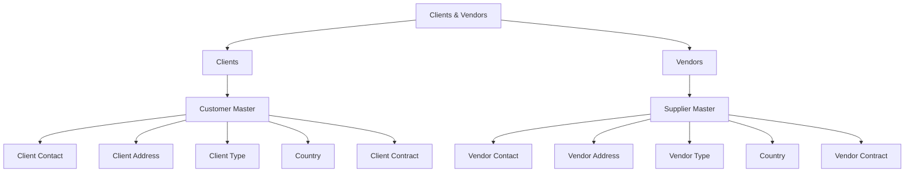

---

# 4. Client Contract

## Definition

A **Client Contract** represents the commercial agreement between the manpower company and an overseas client.

It defines the terms under which manpower requirements, deployments, billing, and profitability are managed.

## Mermaid

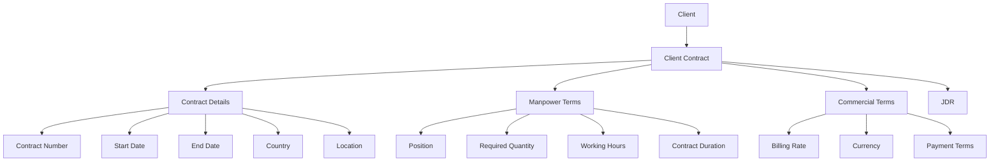

---

# 5. JDR — Job Demand Request

## Definition

The **JDR** is the central manpower-demand document.

It represents a client's request for workers and starts the recruitment process.

One JDR can contain multiple positions.

Example:

- 50 Electricians
- 20 Welders
- 10 Plumbers

## Mermaid

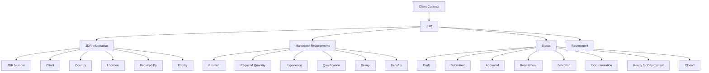

---

# 6. Recruitment

## Definition

The **Recruitment** module converts an approved JDR into job openings, candidates, screening, interviews, selection, offers, and eventually employees.

## Mermaid

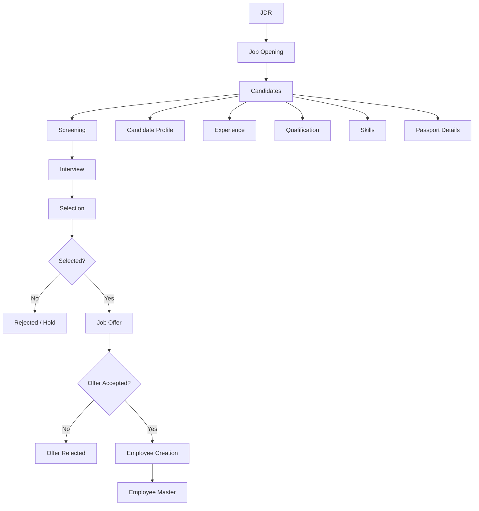

---

# 7. Employee Master

## Definition

The **Employee Master** is the central HR record for a worker after recruitment/selection.

It should hold core employee information while linking specialized records such as Passport, Iqama, Visa, Contract, and Deployment.

## Mermaid

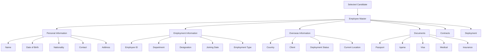

---

# 8. Employee Documents

## Definition

The **Employee Documents** layer manages identity, immigration, medical, insurance, qualification, and employment documents.

Each document can have an issue date, expiry date, attachment, and verification status.

## Mermaid

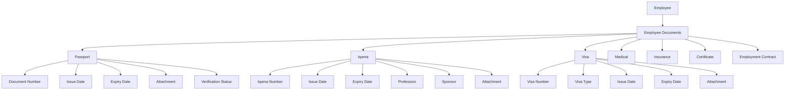

---

# 9. Passport

## Definition

The **Passport** module tracks passport identity information, validity, scanned documents, and renewal requirements.

## Mermaid

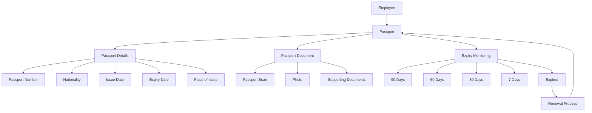

---

# 10. Iqama

## Definition

The **Iqama** module manages an employee's Saudi residence/work-permit record, related documents, verification, expiry monitoring, and renewal lifecycle.

> **Important:** The actual legal document checklist should be configurable according to the company's current Saudi process and the employee's case. Do not hard-code a universal legal checklist.

## Mermaid

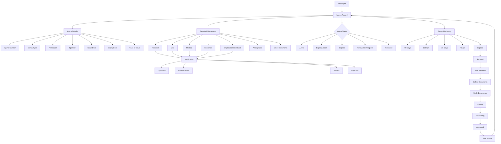

---

# 11. Visa

## Definition

The **Visa** module tracks visa details, supporting documents, processing stages, approval/rejection, and expiry.

## Mermaid

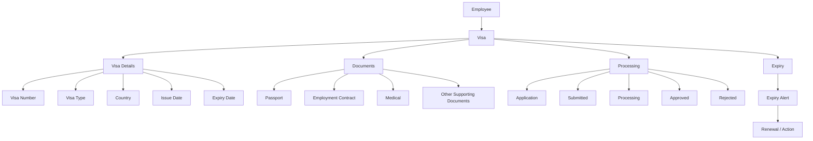

---

# 12. Employee Contract

## Definition

The **Employee Contract** represents the employment agreement between the company and the employee.

It is different from the Client Contract.

## Mermaid

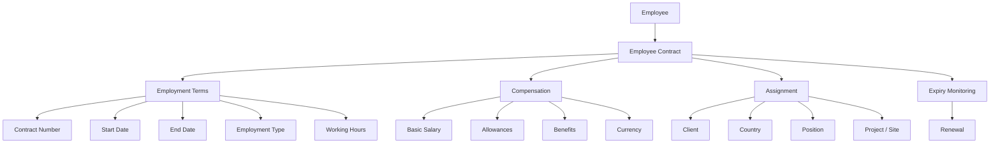

---

# 13. Deployment

## Definition

The **Deployment** module records where, when, and under which client/project an employee is deployed.

It connects the JDR, employee, client, project/site, travel, and joining process.

## Mermaid

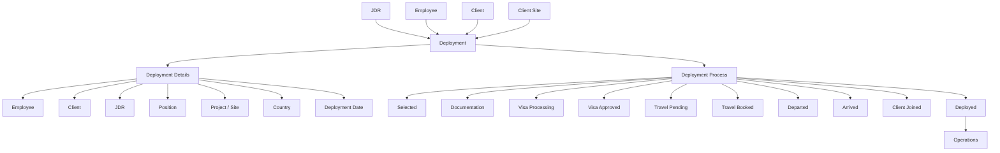

---

# 14. Timesheet / Operations

## Definition

The **Operations** layer manages the employee after deployment, including attendance, leave, timesheets, working hours, activities, billing rates, and cost rates.

## Mermaid

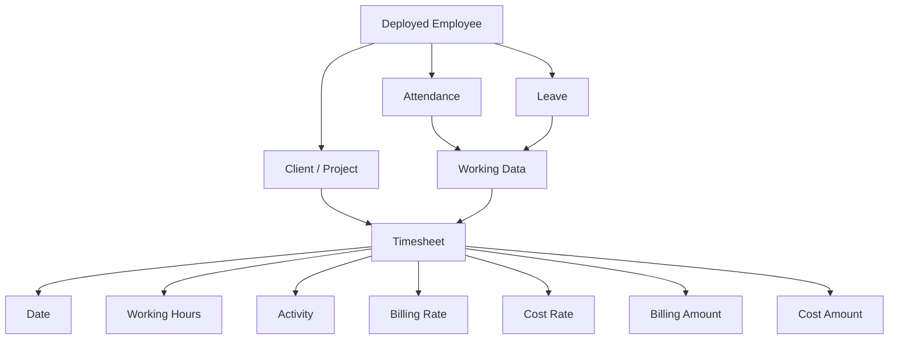

---

# 15. Employee Cost

## Definition

The **Employee Cost** module calculates the actual cost of an employee to the company, including salary and deployment-related expenses.

## Mermaid

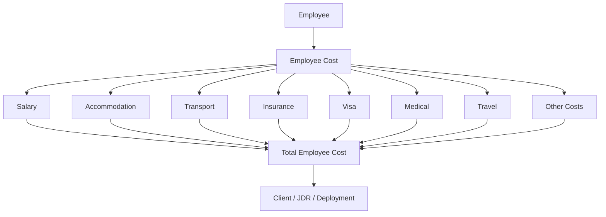

---

# 16. Vendor Cost

## Definition

The **Vendor Cost** module tracks money spent on external suppliers and links each cost to the relevant JDR, employee, or deployment.

## Mermaid

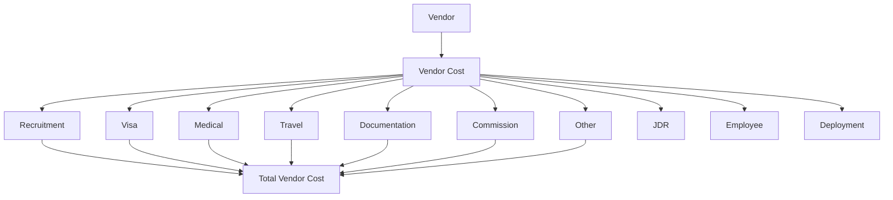

---

# 17. Client Billing

## Definition

The **Client Billing** module converts contractual rates, employee deployments, timesheets, and other billable items into invoices and recognized revenue.

## Mermaid

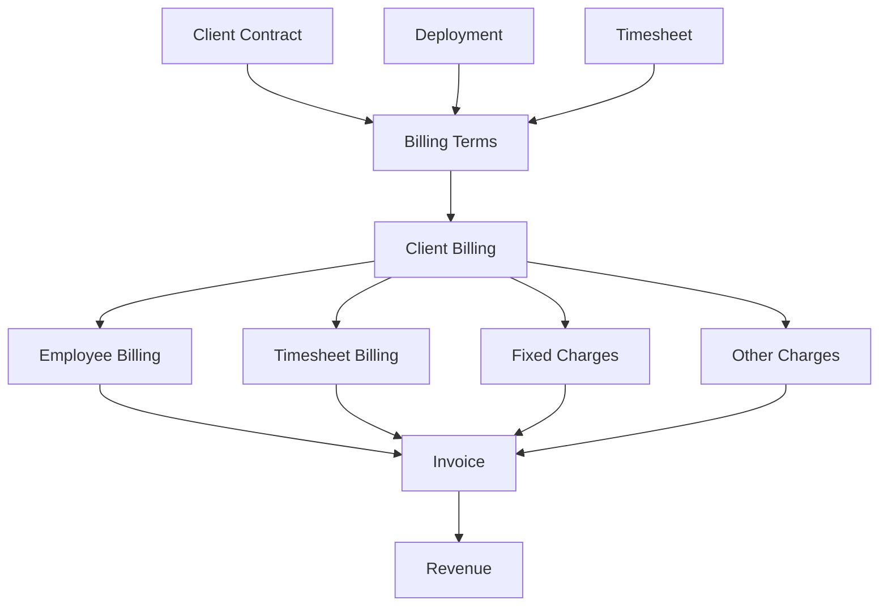

---

# 18. Margin Reporting

## Definition

The **Margin Reporting** layer determines profitability by comparing client revenue with employee, vendor, and operational costs.

## Mermaid

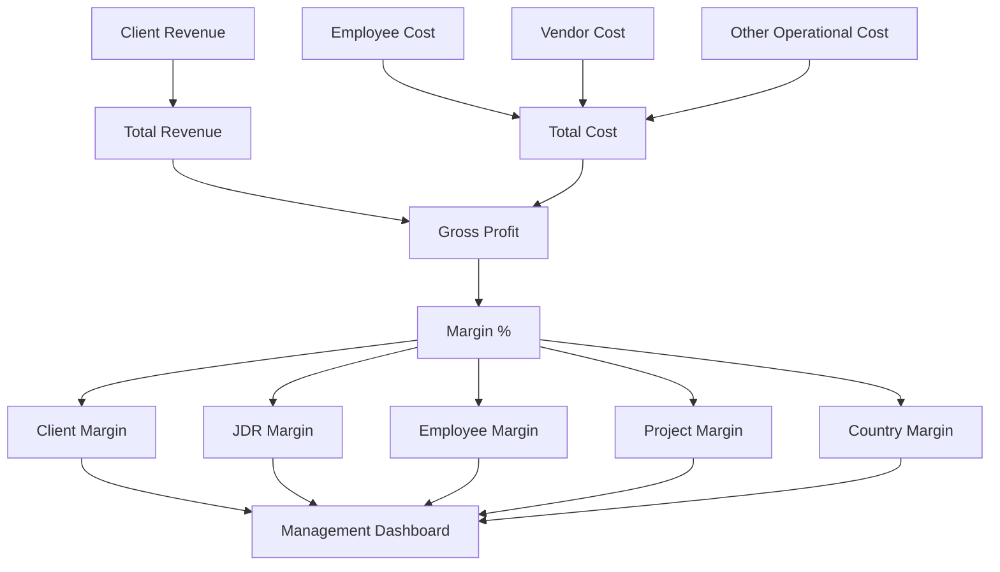

---

# 19. Expiry Management

## Definition

The **Expiry Management** engine monitors dates for passports, Iqamas, visas, medical documents, insurance, contracts, and certifications.

It generates warnings and starts renewal/action processes.

## Mermaid

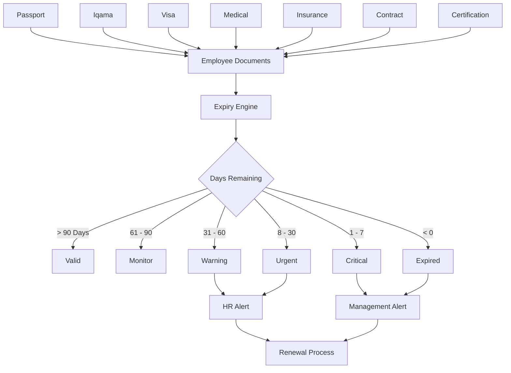

---

# 20. Management Dashboard

## Definition

The **Management Dashboard** is the final reporting layer. It gives management a consolidated view of manpower, recruitment, deployment, document expiry, revenue, cost, and profitability.

## Mermaid

```mermaid
flowchart TD
    %% =========================================================
    %% MANAGEMENT DASHBOARD
    %% Executive reporting layer.
    %% =========================================================

    A[Management Dashboard]

    %% Organization KPIs.
    A --> B[Organization]
    B --> B1[Branches]
    B --> B2[Departments]
    B --> B3[Users]

    %% Recruitment KPIs.
    A --> C[Recruitment]
    C --> C1[Open JDRs]
    C --> C2[Candidates]
    C --> C3[Selected]
    C --> C4[Pending Recruitment]

    %% Employee KPIs.
    A --> D[Employees]
    D --> D1[Total Employees]
    D --> D2[Deployed]
    D --> D3[Available]
    D --> D4[Under Processing]

    %% Deployment KPIs.
    A --> E[Deployment]
    E --> E1[Visa Processing]
    E --> E2[Travel Pending]
    E --> E3[Ready]
    E --> E4[Deployed]

    %% Document expiry KPIs.
    A --> F[Documents]
    F --> F1[Passport Expiry]
    F --> F2[Iqama Expiry]
    F --> F3[Visa Expiry]
    F --> F4[Contract Expiry]

    %% Commercial KPIs.
    A --> G[Commercial]
    G --> G1[Revenue]
    G --> G2[Employee Cost]
    G --> G3[Vendor Cost]
    G --> G4[Gross Profit]
    G --> G5[Margin %]
```

---

# 21. Complete System Architecture

## Definition

This is the **master architecture**. It shows how the entire system is connected from organization setup to recruitment, employee management, immigration documents, deployment, operations, costing, billing, expiry alerts, and management reporting.

## Mermaid

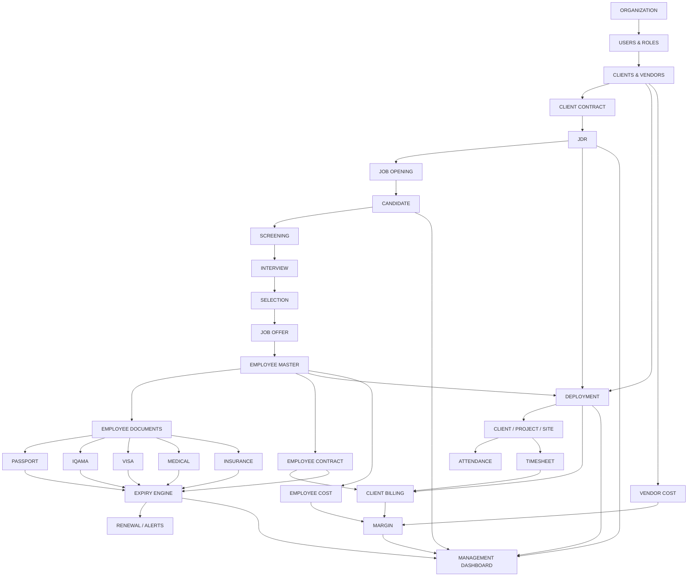

---

# 22. Recommended Implementation Order

## Definition

This diagram shows the order in which the ERP should be implemented. The sequence follows data dependencies.

For example, Iqama depends on Employee, Employee depends on Recruitment, and Recruitment depends on JDR.

## Mermaid

```mermaid
flowchart LR
    %% =========================================================
    %% IMPLEMENTATION ORDER
    %% Build according to data dependencies.
    %% =========================================================

    A[1. Organization] --> B[2. Users & Roles]
    B --> C[3. Clients & Vendors]
    C --> D[4. Client Contracts]
    D --> E[5. JDR]
    E --> F[6. Recruitment]
    F --> G[7. Employee Master]
    G --> H[8. Employee Documents]
    H --> I[9. Passport / Iqama / Visa]
    I --> J[10. Employee Contract]
    J --> K[11. Deployment]
    K --> L[12. Timesheets / Operations]
    L --> M[13. Costs]
    M --> N[14. Billing / Margin]
    N --> O[15. Expiry Alerts]
    O --> P[16. Dashboards]
```

---

# 23. Core Business Flow

## Definition

This is the shortest representation of the company's actual business process.

```mermaid
flowchart TD
    %% =========================================================
    %% CORE BUSINESS FLOW
    %% One client requirement through to profitability.
    %% =========================================================

    A[CLIENT] --> B[CLIENT CONTRACT]
    B --> C[JDR]
    C --> D[RECRUITMENT]
    D --> E[CANDIDATE]
    E --> F[SELECTION]
    F --> G[EMPLOYEE]
    G --> H[DOCUMENTATION]
    H --> I[IQAMA / VISA / PASSPORT]
    I --> J[DEPLOYMENT]
    J --> K[CLIENT / SITE]
    K --> L[TIMESHEET]
    L --> M[BILLING]
    G --> N[EMPLOYEE COST]
    K --> O[VENDOR COST]
    M --> P[REVENUE]
    N --> Q[TOTAL COST]
    O --> Q
    P --> R[PROFIT / MARGIN]
    I --> S[EXPIRY MONITORING]
    S --> T[RENEWAL / ALERT]
```

---

# 24. Key Data Relationships

## Definition

These are the relationships that should exist between the main ERP records. They prevent the system from becoming a collection of disconnected forms.

```mermaid
flowchart TD
    %% =========================================================
    %% KEY DATA RELATIONSHIPS
    %% =========================================================

    CLIENT[Client] --> CONTRACT[Client Contract]
    CONTRACT --> JDR[JDR]

    JDR --> CANDIDATE[Candidate]
    CANDIDATE --> EMPLOYEE[Employee]

    EMPLOYEE --> PASSPORT[Passport]
    EMPLOYEE --> IQAMA[Iqama]
    EMPLOYEE --> VISA[Visa]
    EMPLOYEE --> MEDICAL[Medical]
    EMPLOYEE --> INSURANCE[Insurance]
    EMPLOYEE --> EMP_CONTRACT[Employee Contract]

    JDR --> DEPLOYMENT[Deployment]
    EMPLOYEE --> DEPLOYMENT
    CLIENT --> DEPLOYMENT

    DEPLOYMENT --> SITE[Client Project / Site]

    SITE --> TIMESHEET[Timesheet]
    EMPLOYEE --> EMP_COST[Employee Cost]

    VENDOR[Vendor] --> VENDOR_COST[Vendor Cost]
    VENDOR_COST --> JDR
    VENDOR_COST --> EMPLOYEE
    VENDOR_COST --> DEPLOYMENT

    CLIENT --> BILLING[Client Billing]
    DEPLOYMENT --> BILLING
    TIMESHEET --> BILLING

    BILLING --> REVENUE[Revenue]
    EMP_COST --> COST[Total Cost]
    VENDOR_COST --> COST

    REVENUE --> MARGIN[Margin]
    COST --> MARGIN

    PASSPORT --> EXPIRY[Expiry Engine]
    IQAMA --> EXPIRY
    VISA --> EXPIRY
    MEDICAL --> EXPIRY
    INSURANCE --> EXPIRY
    EMP_CONTRACT --> EXPIRY

    EXPIRY --> ALERTS[Alerts / Renewal]
```

---

# 25. Design Rules

The following rules should be followed during implementation:

1. **Use standard ERPNext/Frappe HR DocTypes where they already solve the problem.**
2. **Create custom DocTypes only for business objects that ERPNext does not model correctly.**
3. **JDR should be a major custom DocType.**
4. **Deployment should be a major custom DocType.**
5. **Iqama needs a specialized workflow because it has documents, verification, expiry, and renewal.**
6. **Do not duplicate Customer, Supplier, Employee, Timesheet, Invoice, or accounting data unnecessarily.**
7. **Use Link fields to connect records instead of manually typing names.**
8. **Use child tables for repeating structures such as multiple positions in a JDR.**
9. **Use Workflow for approval/status transitions rather than relying only on editable status fields.**
10. **Keep historical records for documents such as Passport and Iqama instead of overwriting old records.**
11. **Make expiry thresholds configurable.**
12. **Build dashboards only after the underlying data is reliable.**
13. **Test every phase before moving to the next dependency.**

---

# 26. Final Dependency Chain

```mermaid
flowchart LR
    %% =========================================================
    %% FINAL DEPENDENCY CHAIN
    %% =========================================================

    A[Organization]
    --> B[Users]
    --> C[Client]
    --> D[Client Contract]
    --> E[JDR]
    --> F[Candidate]
    --> G[Employee]
    --> H[Documents]
    --> I[Iqama / Visa / Passport]
    --> J[Employee Contract]
    --> K[Deployment]
    --> L[Timesheet]
    --> M[Cost]
    --> N[Billing]
    --> O[Margin]
    --> P[Expiry Alerts]
    --> Q[Management Dashboard]
```

> **Core principle:** `Client → Contract → JDR → Candidate → Employee → Documents → Deployment → Operations → Cost → Billing → Margin → Alerts → Dashboard`.
