# Overseas Manpower ERPNext — Uniform Mermaid Blueprint

> **Format used for every module:** Definition → Simple Business Flow → Vertical Mermaid.
>
> The diagrams are intentionally simple and vertical. Decision points use explicit **Yes / No** branches wherever the process has a real condition.

---

# 1. Organization

## Definition

The **Organization** module defines the company's internal structure, including company, branches, departments, designations, and employment types.

## Simple Business Flow

```text
Company
 ↓
Branches
 ↓
Departments
 ↓
Designations
 ↓
Employment Types
```

## Mermaid

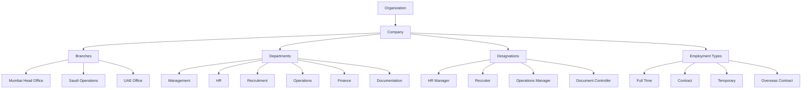

---

# 2. Users & Roles

## Definition

The **Users & Roles** module controls who can access the ERP, which business area they can access, and what actions they can perform.

## Simple Business Flow

```text
User
 ↓
Role
 ↓
Module Access
 ↓
Permissions
```

## Mermaid

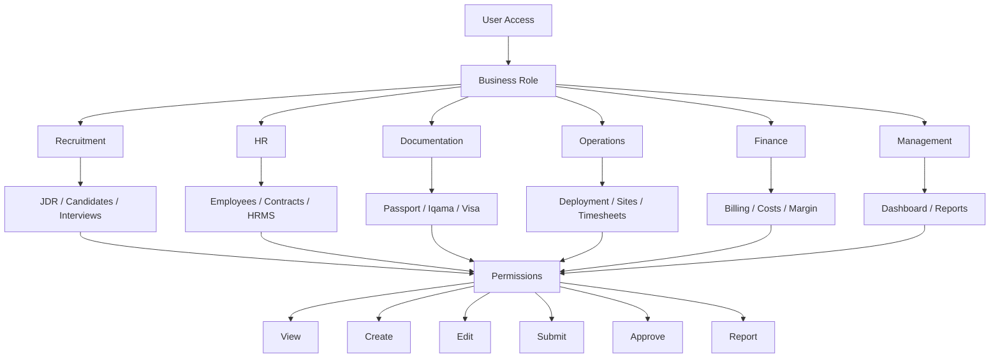

---

# 3. Clients & Vendors

## Definition

The **Clients & Vendors** module manages the external organizations involved in the overseas manpower business.

## Simple Business Flow

```text
External Party
 ↓
Client / Vendor
 ↓
Master Details
 ↓
Contract / Cost
```

## Mermaid

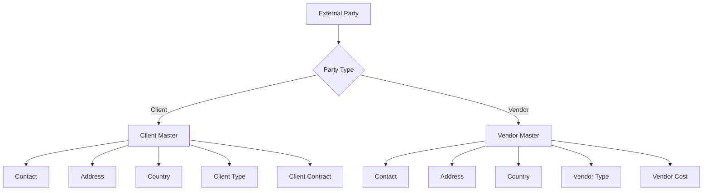

---

# 4. Client Contract

## Definition

The **Client Contract** records the commercial agreement between the manpower company and an overseas client.

## Simple Business Flow

```text
Client
 ↓
Contract
 ↓
Manpower Terms
 ↓
Commercial Terms
 ↓
JDR
```

## Mermaid

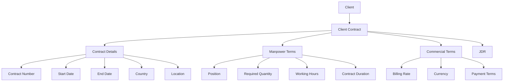

---

# 5. JDR — Job Demand Request

## Definition

The **JDR** is the main manpower-demand record. It captures what the overseas client needs and starts the recruitment process.

## Simple Business Flow

```text
Client Contract
 ↓
JDR
 ↓
Manpower Requirement
 ↓
Approval
 ↓
Recruitment
```

## Mermaid

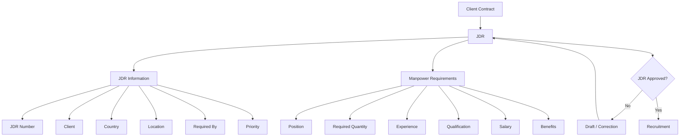

---

# 6. Overseas Recruitment

## Definition

The **Overseas Recruitment** module manages the process of selecting candidates for overseas client requirements, from sourcing and screening to client approval, documentation, medical/visa processing, and deployment readiness.

## Simple Business Flow

```text
Approved JDR
 ↓
Candidate Sourcing
 ↓
Screening
 ↓
Document Verification
 ↓
Interview / Trade Test
 ↓
Client Selection
 ↓
Offer & Contract
 ↓
Medical & Compliance
 ↓
Visa Processing
 ↓
Deployment Ready
 ↓
Employee
 ↓
Deployment
```

## Mermaid

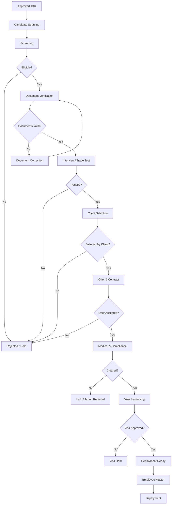

---

# 7. Employee Master

## Definition

The **Employee Master** is the central HR record created after a candidate successfully completes recruitment.

## Simple Business Flow

```text
Selected Candidate
 ↓
Employee Master
 ↓
Personal Information
 ↓
Employment Information
 ↓
Overseas Information
 ↓
Documents / Contract / Deployment
```

## Mermaid

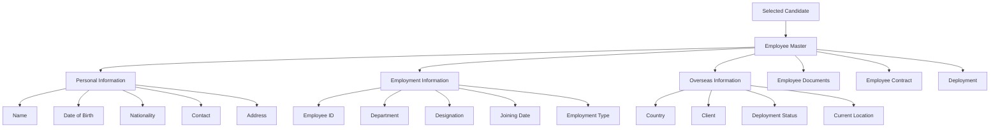

---

# 8. Employee Documents

## Definition

The **Employee Documents** module stores and verifies documents required for employee identity, overseas employment, immigration, medical, insurance, and compliance.

## Simple Business Flow

```text
Employee
 ↓
Documents
 ↓
Upload
 ↓
Verify
 ↓
Valid / Rejected
 ↓
Expiry Monitoring
```

## Mermaid

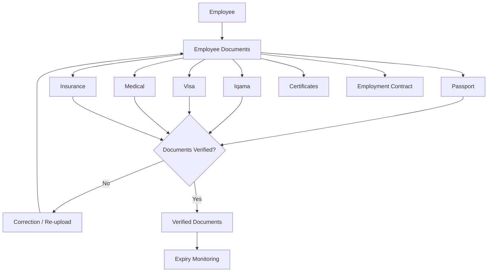

---

# 9. Passport

## Definition

The **Passport** module tracks passport identity information, validity, scanned documents, and renewal status.

## Simple Business Flow

```text
Employee
 ↓
Passport
 ↓
Passport Details
 ↓
Expiry Monitoring
 ↓
Renewal if Required
```

## Mermaid

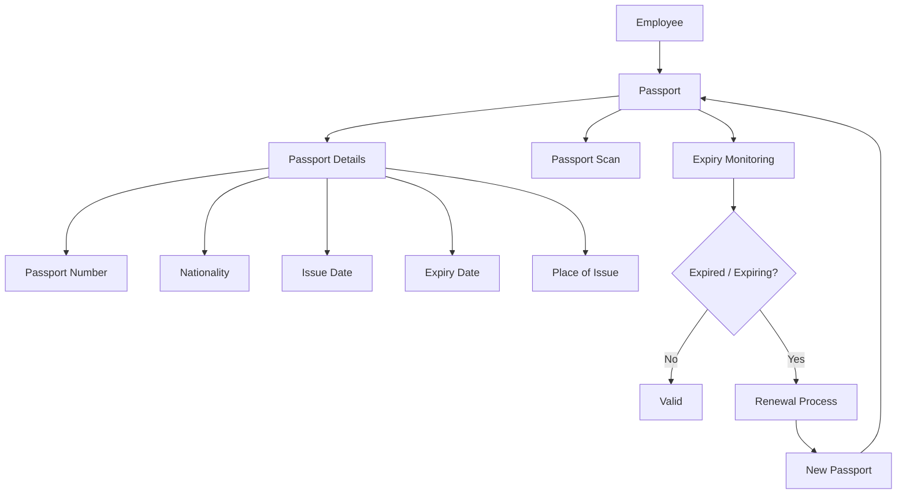

---

# 10. Iqama

## Definition

The **Iqama** module manages the employee's Saudi residence/work-permit record, supporting documents, verification, expiry, and renewal.

## Simple Business Flow

```text
Employee
 ↓
Iqama Record
 ↓
Documents
 ↓
Verification
 ↓
Active
 ↓
Expiry Alert
 ↓
Renewal
 ↓
New Iqama
```

## Mermaid

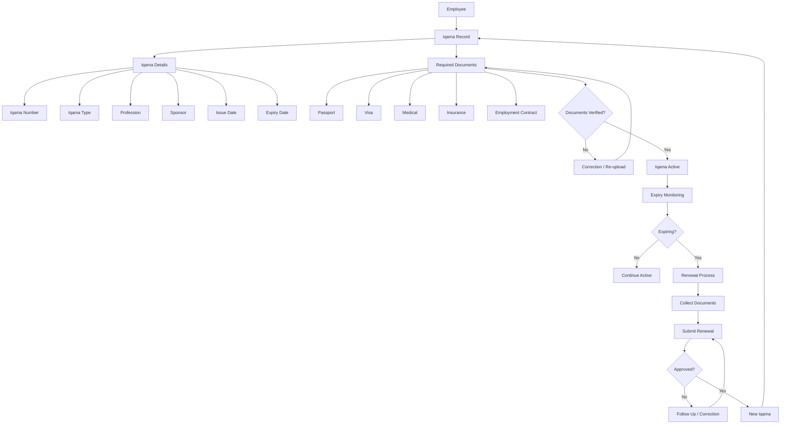

---

# 11. Visa

## Definition

The **Visa** module manages overseas visa information, supporting documents, processing, approval, rejection, and expiry.

## Simple Business Flow

```text
Employee
 ↓
Visa Application
 ↓
Documents
 ↓
Processing
 ↓
Approval
 ↓
Visa Active
```

## Mermaid

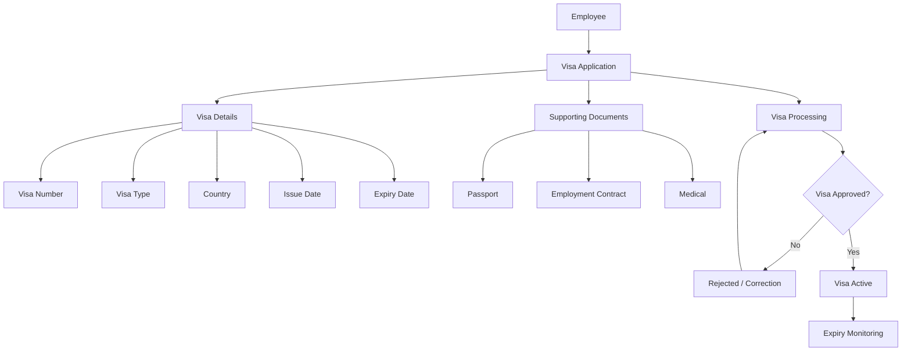

---

# 12. Employee Contract

## Definition

The **Employee Contract** represents the employment agreement between the company and the employee, including terms, compensation, assignment, and validity.

## Simple Business Flow

```text
Employee
 ↓
Employment Contract
 ↓
Terms & Compensation
 ↓
Assignment
 ↓
Active Contract
 ↓
Expiry / Renewal
```

## Mermaid

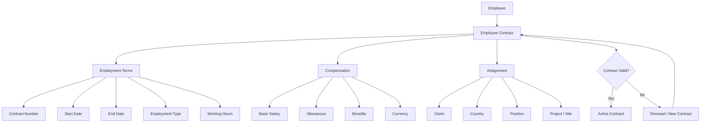

---

# 13. Deployment

## Definition

The **Deployment** module manages the movement and assignment of an employee to an overseas client, project, or site.

## Simple Business Flow

```text
Employee
 ↓
Deployment Record
 ↓
Documentation
 ↓
Visa
 ↓
Travel
 ↓
Arrival
 ↓
Client Joining
 ↓
Deployed
```

## Mermaid

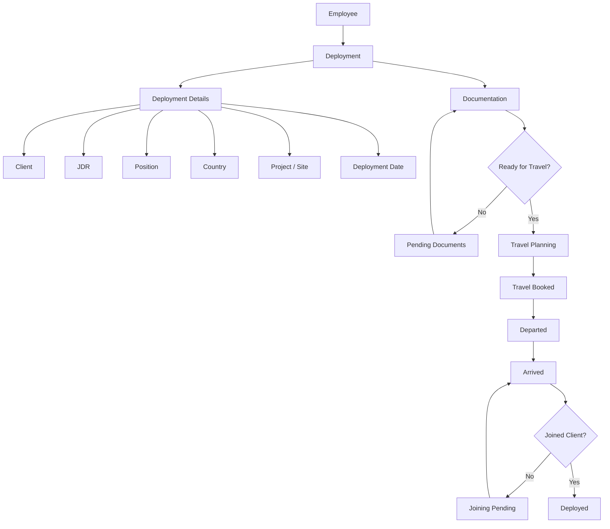

---

# 14. Timesheet / Operations

## Definition

The **Timesheet / Operations** module manages the employee's work activity after deployment, including attendance, leave, hours, and billable work.

## Simple Business Flow

```text
Deployed Employee
 ↓
Client / Project
 ↓
Attendance / Leave
 ↓
Timesheet
 ↓
Working Hours
 ↓
Billing / Cost
```

## Mermaid

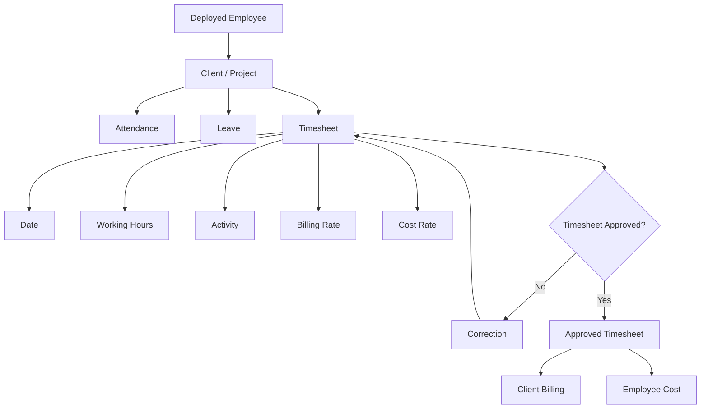

---

# 15. Employee Cost

## Definition

The **Employee Cost** module calculates the total cost associated with employing and deploying a worker.

## Simple Business Flow

```text
Employee
 ↓
Salary + Benefits + Deployment Costs
 ↓
Total Employee Cost
 ↓
Client / JDR / Deployment
 ↓
Margin
```

## Mermaid

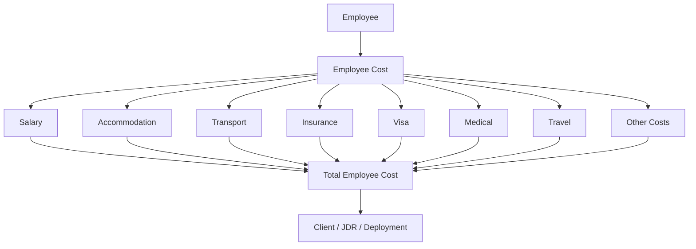

---

# 16. Vendor Cost

## Definition

The **Vendor Cost** module tracks costs paid to external vendors such as recruitment agencies, medical providers, travel providers, and documentation service providers.

## Simple Business Flow

```text
Vendor
 ↓
Vendor Cost
 ↓
Cost Category
 ↓
JDR / Employee / Deployment
 ↓
Total Vendor Cost
```

## Mermaid

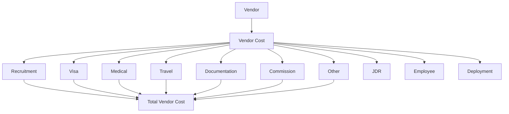

---

# 17. Client Billing

## Definition

The **Client Billing** module converts client contract rates, deployments, timesheets, and other billable items into invoices and revenue.

## Simple Business Flow

```text
Client Contract
 ↓
Deployment / Timesheet
 ↓
Billing
 ↓
Invoice
 ↓
Revenue
```

## Mermaid

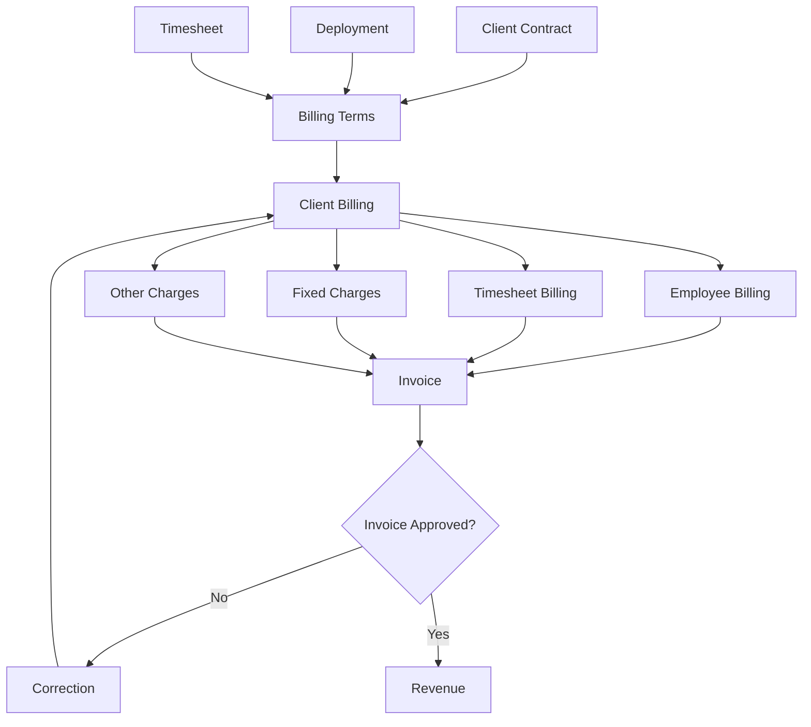

---

# 18. Margin Reporting

## Definition

The **Margin Reporting** module compares client revenue against employee, vendor, and other operational costs to determine profitability.

## Simple Business Flow

```text
Revenue
 ↓
Total Revenue
 ↓
Minus Total Cost
 ↓
Gross Profit
 ↓
Margin %
 ↓
Client / JDR / Project / Country
```

## Mermaid

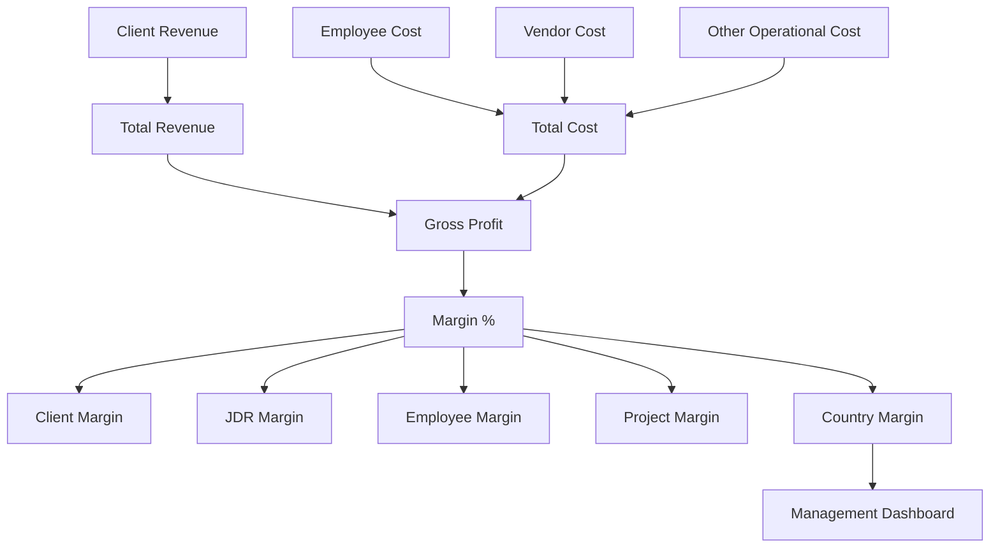

---

# 19. Expiry Management

## Definition

The **Expiry Management** module monitors employee documents and contracts and generates alerts before they expire.

## Simple Business Flow

```text
Employee Documents
 ↓
Expiry Engine
 ↓
Days Remaining
 ↓
Alert
 ↓
Renewal / Action
```

## Mermaid

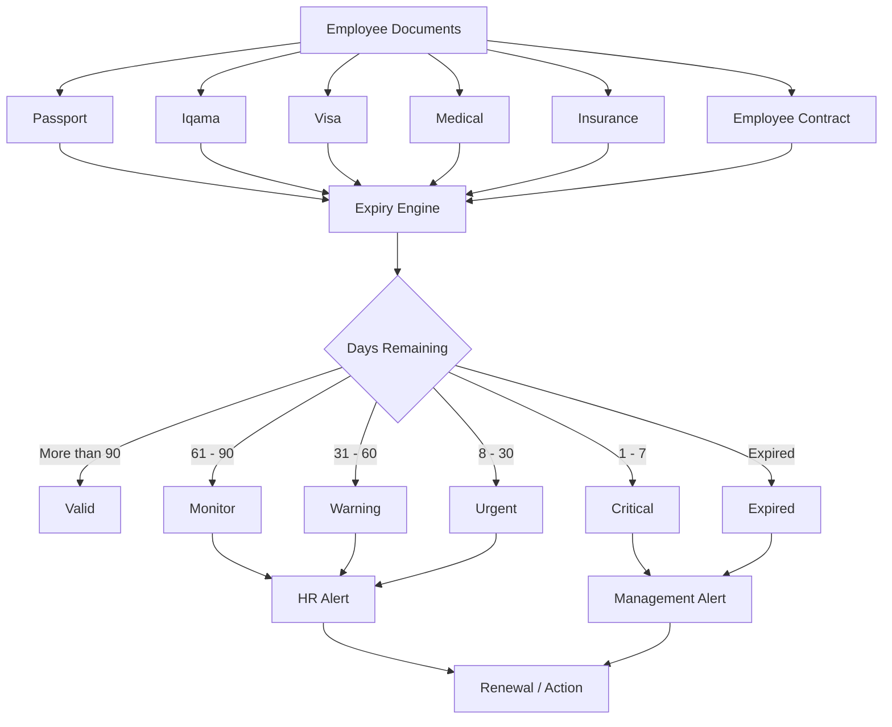

---

# 20. Management Dashboard

## Definition

The **Management Dashboard** provides management with a consolidated view of recruitment, employees, deployment, document expiry, revenue, costs, and margins.

## Simple Business Flow

```text
ERP Data
 ↓
KPIs
 ↓
Dashboard
 ↓
Management Decisions
```

## Mermaid

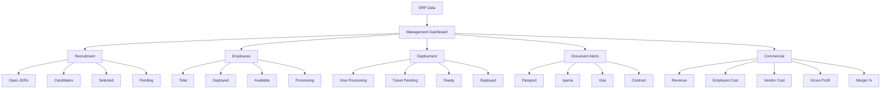

---

# 21. Complete System Architecture

## Definition

The **Complete System Architecture** shows how the major modules connect from the initial client requirement through recruitment, HR, documentation, deployment, operations, costing, billing, alerts, and management reporting.

## Simple Business Flow

```text
Organization
 ↓
Client
 ↓
Contract
 ↓
JDR
 ↓
Recruitment
 ↓
Employee
 ↓
Documents
 ↓
Deployment
 ↓
Operations
 ↓
Cost / Billing
 ↓
Margin
 ↓
Dashboard
```

## Mermaid

```mermaid
flowchart TD
    %% =========================================================
    %% COMPLETE OVERSEAS MANPOWER ERP
    %% =========================================================

    A["Organization"]
    A --> B["Users & Roles"]
    B --> C["Clients & Vendors"]
    C --> D["Client Contract"]
    D --> E["JDR"]

    E --> F["Overseas Recruitment"]
    F --> G["Employee Master"]

    G --> H["Employee Documents"]
    H --> H1["Passport"]
    H --> H2["Iqama"]
    H --> H3["Visa"]
    H --> H4["Medical"]
    H --> H5["Insurance"]

    G --> I["Employee Contract"]
    G --> J["Deployment"]

    J --> K["Client / Project / Site"]
    K --> L["Timesheet / Operations"]

    G --> M["Employee Cost"]
    C --> N["Vendor Cost"]

    L --> O["Client Billing"]
    J --> O
    I --> O

    M --> P["Margin"]
    N --> P
    O --> P

    H --> Q["Expiry Management"]
    I --> Q

    P --> R["Management Dashboard"]
    Q --> R
    F --> R
    J --> R
```

---

# 22. Recommended Implementation Order

## Definition

The **Implementation Order** shows which modules should be built first based on their data dependencies.

## Simple Business Flow

```text
Foundation
 ↓
Masters
 ↓
Recruitment
 ↓
Employee
 ↓
Documents
 ↓
Deployment
 ↓
Operations
 ↓
Commercial
 ↓
Alerts
 ↓
Dashboard
```

## Mermaid

```mermaid
flowchart TD
    %% =========================================================
    %% IMPLEMENTATION ORDER
    %% Build from foundation to reporting.
    %% =========================================================

    A["1. Organization"]
    A --> B["2. Users & Roles"]
    B --> C["3. Clients & Vendors"]
    C --> D["4. Client Contract"]
    D --> E["5. JDR"]
    E --> F["6. Overseas Recruitment"]
    F --> G["7. Employee Master"]
    G --> H["8. Employee Documents"]
    H --> I["9. Passport / Iqama / Visa"]
    I --> J["10. Employee Contract"]
    J --> K["11. Deployment"]
    K --> L["12. Timesheet / Operations"]
    L --> M["13. Employee / Vendor Cost"]
    M --> N["14. Client Billing / Margin"]
    N --> O["15. Expiry Management"]
    O --> P["16. Management Dashboard"]
```

---

# 23. Core Business Flow

## Definition

The **Core Business Flow** represents the company's main business journey from receiving an overseas manpower requirement to generating revenue and monitoring employee documents.

## Simple Business Flow

```text
Client
 ↓
Contract
 ↓
JDR
 ↓
Recruitment
 ↓
Employee
 ↓
Documentation
 ↓
Deployment
 ↓
Timesheet
 ↓
Billing
 ↓
Margin
```

## Mermaid

```mermaid
flowchart TD
    %% =========================================================
    %% CORE BUSINESS FLOW
    %% Main overseas manpower business process.
    %% =========================================================

    A["Client"]
    A --> B["Client Contract"]
    B --> C["JDR"]
    C --> D["Overseas Recruitment"]
    D --> E["Candidate"]

    E --> F{"Selected?"}
    F -->|No| G["Rejected / Hold"]
    F -->|Yes| H["Employee"]

    H --> I["Documentation"]
    I --> J{"Ready for Deployment?"}

    J -->|No| K["Pending Requirements"]
    K --> I

    J -->|Yes| L["Deployment"]
    L --> M["Client / Site"]
    M --> N["Timesheet"]

    N --> O["Client Billing"]
    H --> P["Employee Cost"]
    M --> Q["Vendor Cost"]

    O --> R["Revenue"]
    P --> S["Total Cost"]
    Q --> S

    R --> T["Profit / Margin"]
```

---

# 24. Key Data Relationships

## Definition

The **Key Data Relationships** show how the main records are connected. These links are important for traceability and reporting.

## Simple Business Flow

```text
Client
 ↓
Contract
 ↓
JDR
 ↓
Candidate
 ↓
Employee
 ↓
Documents / Contract
 ↓
Deployment
 ↓
Operations
 ↓
Cost / Billing
 ↓
Margin
```

## Mermaid

```mermaid
flowchart TD
    %% =========================================================
    %% KEY DATA RELATIONSHIPS
    %% Main records and their relationships.
    %% =========================================================

    A["Client"]
    A --> B["Client Contract"]
    B --> C["JDR"]
    C --> D["Candidate"]
    D --> E["Employee"]

    E --> F["Passport"]
    E --> G["Iqama"]
    E --> H["Visa"]
    E --> I["Medical"]
    E --> J["Insurance"]
    E --> K["Employee Contract"]

    C --> L["Deployment"]
    E --> L
    A --> L

    L --> M["Client Project / Site"]
    M --> N["Timesheet"]

    E --> O["Employee Cost"]
    A --> P["Vendor"]
    P --> Q["Vendor Cost"]

    N --> R["Client Billing"]
    L --> R

    O --> S["Total Cost"]
    Q --> S

    R --> T["Revenue"]
    S --> U["Margin"]
    T --> U

    F --> V["Expiry Management"]
    G --> V
    H --> V
    I --> V
    J --> V
    K --> V

    U --> W["Management Dashboard"]
    V --> W
```

---

# 25. Final Dependency Chain

## Definition

The **Final Dependency Chain** is the shortest representation of the complete ERP dependency structure.

## Simple Business Flow

```text
Organization
 ↓
Users
 ↓
Client
 ↓
Contract
 ↓
JDR
 ↓
Candidate
 ↓
Employee
 ↓
Documents
 ↓
Deployment
 ↓
Operations
 ↓
Cost
 ↓
Billing
 ↓
Margin
 ↓
Alerts
 ↓
Dashboard
```

## Mermaid

```mermaid
flowchart TD
    %% =========================================================
    %% FINAL DEPENDENCY CHAIN
    %% High-level system dependency.
    %% =========================================================

    A["Organization"]
    A --> B["Users"]
    B --> C["Client"]
    C --> D["Client Contract"]
    D --> E["JDR"]
    E --> F["Candidate"]
    F --> G["Employee"]
    G --> H["Documents"]
    H --> I["Iqama / Visa / Passport"]
    I --> J["Employee Contract"]
    J --> K["Deployment"]
    K --> L["Timesheet / Operations"]
    L --> M["Cost"]
    M --> N["Billing"]
    N --> O["Margin"]
    O --> P["Expiry Alerts"]
    P --> Q["Management Dashboard"]
```

---

# Design Principle

Every module follows the same documentation pattern:

```text
Definition
     ↓
Simple Business Flow
     ↓
Vertical Mermaid
     ↓
Decision / Yes-No Branches where required
```

The main system principle is:

```text
Client
 ↓
Contract
 ↓
JDR
 ↓
Overseas Recruitment
 ↓
Employee
 ↓
Documents
 ↓
Deployment
 ↓
Operations
 ↓
Cost + Billing
 ↓
Margin
 ↓
Expiry Alerts
 ↓
Management Dashboard
```
